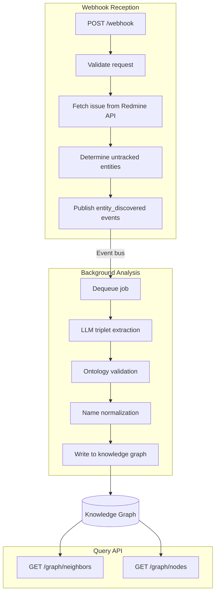

# Lapidary

[](https://github.com/elct9620/lapidary-rb/actions/workflows/ci.yml)
[](https://codecov.io/gh/elct9620/lapidary-rb)

A knowledge graph builder that maps relationships between Ruby contributors and core modules from bugs.ruby-lang.org issue data.

## Overview

Lapidary helps researchers understand the evolution of the Ruby language and community collaboration patterns. It ingests issue data from [bugs.ruby-lang.org](https://bugs.ruby-lang.org/) via webhooks, extracts structured relationships using LLM, and builds a queryable knowledge graph of (Rubyist, Relationship, Module) triplets.

## How It Works



### 1. Webhook Reception

An external system detects a change to an issue on bugs.ruby-lang.org and sends a webhook containing the Issue ID. Lapidary fetches the full issue data (including journals) from the Redmine JSON API and creates analysis jobs for each untracked entity.

### 2. Analysis

A background worker dequeues jobs and sends issue/journal content to an LLM for triplet extraction. The LLM identifies relationships like "matz Maintains Array" or "nobu Contributes to String" from the discussion text.

### 3. Knowledge Graph Construction

Extracted triplets are validated against a predefined ontology (permitted node types, relationship types, and domain-range constraints), normalized (e.g., resolving author names to canonical usernames), and written as Nodes and Edges with temporal observation metadata.

### 4. Query

Researchers query the graph to explore relationships — find which modules a Rubyist works with, which contributors are involved in a module, or how involvement patterns change over time with time-range filtering.

### 5. Knowledge Graph Explorer

A built-in browser interface served at `GET /` provides interactive exploration of the knowledge graph. Built with Stimulus.js and Cytoscape.js, it supports node search, graph visualization, direction filtering, and time-range filtering.

## API Endpoints

| Method | Path | Description |
|---|---|---|
| `GET` | `/` | Knowledge Graph Explorer (Web UI) |
| `GET` | `/health` | Health check |
| `POST` | `/webhook` | Receive issue change notifications |
| `GET` | `/graph/neighbors` | Query neighbor nodes with direction and time-range filtering |
| `GET` | `/graph/nodes` | List and search nodes by type, name, with pagination |

## Getting Started

### Prerequisites

- Ruby 3.4

### Setup

```bash
bundle install
bundle exec rake db:migrate
```

### Run

```bash
falcon host
```

Falcon manages both the HTTP server (bound to `0.0.0.0:9292`) and the Analysis Service as supervised background processes.

### Docker

Pre-built images are available from GitHub Container Registry:

```bash
docker run -p 9292:9292 ghcr.io/elct9620/lapidary-rb:latest
```

Or build locally:

```bash
docker build -t lapidary .
docker run -p 9292:9292 lapidary
```

### Console

```bash
bin/console                 # Interactive console with container access
```

The console provides `container` and `db` helpers, plus built-in IRB commands:

**Query commands:**

| Command | Description |
|---|---|
| `nodes [type]` | List nodes, optionally filtered by type (e.g. `nodes rubyist`) |
| `node <id>` | Find a single node by ID (e.g. `node rubyist://matz`) |
| `neighbors <node_id>` | Find all edges connected to a node, including archived |
| `edges [node_id] [--archived]` | List edges, optionally filtered by node or including archived |

**Maintenance commands:**

| Command | Description |
|---|---|
| `rename_node <old_id> <new_id>` | Rename a node ID and update all connected edges |
| `delete_node <node_id>` | Delete a node (purges archived edges first) |
| `archive_edge <source> <target> <relationship>` | Archive an edge and clear associated analysis records |

### Tests

```bash
bundle exec rspec
bundle exec rubocop
```

## Configuration

| Variable | Default | Description |
|---|---|---|
| `RACK_ENV` | `development` | Environment (affects database path) |
| `PORT` | `9292` | HTTP listen port (Falcon) |
| `REDMINE_URL` | `https://bugs.ruby-lang.org` | Redmine JSON API base URL |
| `OPENAI_API_KEY` | — | OpenAI API key for LLM extraction |
| `OPENAI_MODEL` | `gpt-5-mini` | OpenAI model for triplet extraction |
| `WEBHOOK_SECRET` | — | Optional token authentication for webhooks |
| `JOB_RETENTION` | `7d` | TTL for completed/failed jobs (`<number><unit>`: `h`/`d`) |
| `GRAPH_RETENTION` | `180d` | Retention period for graph edges (`<number><unit>`: `h`/`d`) |
| `CLEANUP_INTERVAL` | `86400` | Interval in seconds between retention cleanup runs |
| `TRUSTED_PROXIES` | — | Comma-separated CIDR ranges of trusted reverse proxies |
| `SENTRY_DSN` | — | Sentry DSN for error tracking and performance monitoring |

## Documentation

- [SPEC.md](SPEC.md) — Behavioral specification and user journeys
- [docs/architecture.md](docs/architecture.md) — Architecture and bounded contexts
- [docs/ontology.md](docs/ontology.md) — Ontology specification

## License

[Apache-2.0](LICENSE)
